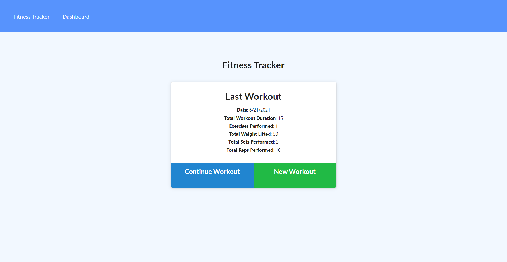

  # 

  # Fitness Tracker

[Go to Fitness Tracker](https://workout-tracker-xr7tsi.herokuapp.com/)

  ## Contents:
  #### [Description](#description:)
  #### [Installation](#installation:)
  #### [Usage](#usage;)
  #### [Contributing](#contributing:)
  #### [Tests](#tests:)
  #### [Questions](#questions:)
  #### [License](#license:)
  &nbsp;
  
  ## Description: 
  Fitness tracker is an app that allows the user to store and view their stats for cardio and resistance workouts.
  &nbsp;
  
  ## Questions?

  #### Github: https://github.com/Xr7TSi
  #### Email me at jrein1296@gmail.com for any additional questions.
  &nbsp;

  License:
  #### Mozilla
  #### https://opensource.org/licenses/MPL-2.0
